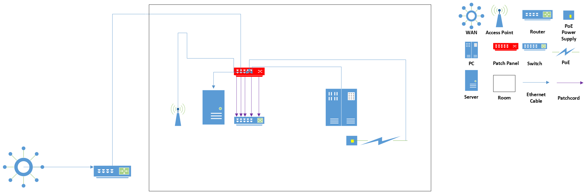

# **Homelab**
homelab project
# **Purpose**
Learning how to build simple network infrastructure and develop practical skills in server administration
# **Hardware**
- Switch Tp link TL-RP108GE
- Access Point Tp link RE200
- Orange Pi zero 2W
- Patch panel Lanberg PPU5-9012-B
- Power Supply Extralink 18V EX.14220 18W
- Type-C 1Gb/s network card
- 64GB Pendrive
- Type-C USB hub
# **Hosted services**
- Docker
- Portainer
- Samba
- Pi hole
- Grafana
- Nginx
- SSH
- Apache
- Tailscale
# **Network topology**

